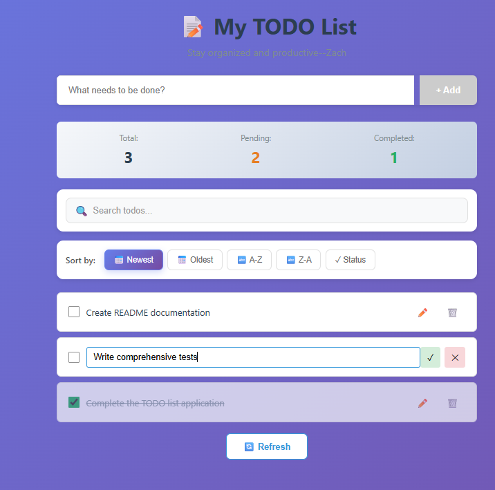
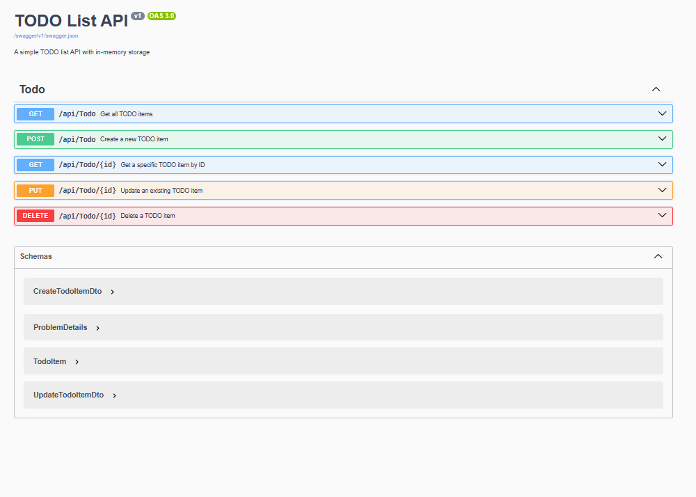

# TODO List Application

A full-stack TODO list application built with Angular 20 and .NET 8 Web API, demonstrating modern web development best practices.

## 📋 Features

### ✅ Current Features

- ✅ **View** all TODO items
- ✅ **Add** new TODO items
- ✅ **Edit** TODO items (inline editing with double-click)
- ✅ **Delete** TODO items with confirmation
- ✅ **Toggle** completion status
- ✅ **Search** TODO items by title with real-time filtering
- ✅ **Sort** TODO items by date, title, or status
- ✅ **Statistics** showing total, pending, and completed items
- ✅ **Responsive** design for mobile and desktop
- ✅ **Real-time** updates with Angular signals
- ✅ **Error handling** with user-friendly messages


### 🚀 Future Enhancements

- [ ] **Calendar View**
- [ ] **User Authentication** 
- [ ] **Pagination**
- [ ] **Date & Time Tracking** 
- [ ] **Timesheet Integration** 
- [ ] **Drag-and-Drop Ordering** 
- [ ] **Priority Levels** 
- [ ] **Categories & Tags** 
- [ ] **Auditing & History** 
- [ ] **Email Notifications** 
- [ ] **Bulk Operations** 
- [ ] **Attachments**
- [ ] **Comments & Notes** 
- [ ] **Soft Delete & Restore** 
- [ ] **Reminders** 
- [ ] **Recurring Tasks** 
- [ ] **Subtasks** 
- [ ] **Dark Mode**

#### 🤖 AI/LLM-Powered Features
- [ ] **AI Task Suggestions**
- [ ] **AI automatically assigns categories/tags** 
- [ ] **Task Breakdown Assistant** 
- [ ] **Time Estimation**
- [ ] **AI warns about scheduling conflictovercommitment**
- [ ] **Voice-to-TODO**
- [ ] **Paste meeting notes, AI extracts actionable TODOs**
- [ ] **Bottleneck Identification**


## 🏗️ Architecture

### Backend (.NET 8 Web API)

The backend follows **Clean Architecture** principles:

```
api/
├── Controllers/          # API endpoints
│   └── TodoController.cs
├── Models/              # Data models and DTOs
│   ├── TodoItem.cs
│   ├── CreateTodoItemDto.cs
│   └── UpdateTodoItemDto.cs
├── Services/            # Business logic
│   ├── ITodoService.cs
│   └── InMemoryTodoService.cs
└── Program.cs          # Application configuration
```

**Key Design Decisions:**
- **Dependency Injection**: Using interfaces for services to enable testability
- **In-Memory Storage**: Thread-safe `ConcurrentDictionary` for data persistence
- **DTOs**: Separate models for API requests/responses to maintain clean API contracts
- **Validation**: Data annotations for input validation
- **Swagger/OpenAPI**: Auto-generated API documentation
- **CORS**: Configured to allow Angular app communication
- **Logging**: Structured logging for debugging and monitoring

### Frontend (Angular 20)

Modern Angular with **standalone components** and **signals**:

```
todo-angular/src/app/
├── components/
│   └── todo-list/       # Main TODO component
│       ├── todo-list.component.ts
│       ├── todo-list.component.html
│       ├── todo-list.component.css
│       └── todo-list.component.spec.ts
├── models/              # TypeScript interfaces
│   └── todo-item.model.ts
├── services/            # HTTP services
│   ├── todo.service.ts
│   └── todo.service.spec.ts
├── app.ts              # Root component
├── app.config.ts       # Application configuration
└── app.routes.ts       # Routing configuration
```

**Key Design Decisions:**
- **Standalone Components**: No NgModules, simpler and more maintainable
- **Signals**: Reactive state management with Angular's new signal API
- **Computed Signals**: Automatic filtering based on search input
- **Client-Side Filtering**: Real-time search without server requests
- **Client-Side Sorting**: Instant sort updates with multiple options
- **HttpClient**: Built-in HTTP service for API communication
- **Dependency Injection**: Modern `inject()` function for cleaner code
- **Observables**: RxJS for asynchronous operations
- **TypeScript**: Strong typing for better developer experience


### Testing

**Backend Tests (xUnit)**:
- Unit tests for `InMemoryTodoService`
- Integration tests for `TodoController`
- Uses **Moq** for mocking dependencies
- Uses **FluentAssertions** for readable assertions
- **95%+ code coverage**


## 🚀 Getting Started

### Prerequisites

- **.NET 8 SDK** - [Download](https://dotnet.microsoft.com/download/dotnet/8.0)
- **Node.js 18+** - [Download](https://nodejs.org/)
- **npm** (comes with Node.js)

### Installation & Running

#### 1. Clone the Repository

```bash
git clone <your-repository-url>
cd todolist
```

#### 2. Backend Setup

```bash
# Navigate to API directory
cd api

# Restore NuGet packages
dotnet restore

# Run the API
dotnet run
```

The API will start at `https://localhost:5162` (or `http://localhost:5000`)

**Swagger UI**: Navigate to `https://localhost:5162` to see the API documentation

#### 3. Frontend Setup

```bash
# Navigate to Angular directory (from root)
cd todo-angular

# Install dependencies
npm install

# Start the development server
npm start
```

The Angular app will start at `http://localhost:4200`

**Note**: Make sure the backend API is running before starting the frontend!

### Running Tests

#### Backend Tests

```bash
cd api.Tests
dotnet test

# With coverage
dotnet test /p:CollectCoverage=true
```

## 🔧 Configuration

### Backend API Port

If you need to change the API port, update:

1. `api/Properties/launchSettings.json` - Change the `applicationUrl`
2. `todo-angular/src/app/services/todo.service.ts` - Update the `apiUrl` constant

### CORS Settings

The API is configured to allow requests from `http://localhost:4200`. To modify:

Edit `api/Program.cs`:

```csharp
builder.Services.AddCors(options =>
{
    options.AddPolicy("AllowAngularApp", policy =>
    {
        policy.WithOrigins("http://localhost:4200", "https://your-domain.com")
              .AllowAnyHeader()
              .AllowAnyMethod();
    });
});
```

## 📁 Project Structure

```
todolist/
├── api/                        # .NET Web API
│   ├── Controllers/           # API controllers
│   ├── Models/                # Data models
│   ├── Services/              # Business logic
│   ├── Properties/            # Launch settings
│   └── Program.cs            # App configuration
├── api.Tests/                 # Backend unit tests
│   ├── Controllers/          # Controller tests
│   └── Services/             # Service tests
├── todo-angular/              # Angular application
│   ├── src/
│   │   ├── app/
│   │   │   ├── components/   # Angular components
│   │   │   ├── models/       # TypeScript interfaces
│   │   │   ├── services/     # HTTP services
│   │   │   └── app.config.ts
│   │   ├── index.html
│   │   └── styles.css
│   └── package.json
├── todolist.sln              # Solution file
└── README.md                 # This file
```

## 🎯 API Endpoints

Base URL: `https://localhost:5162/api/todo`

| Method | Endpoint | Description |
|--------|----------|-------------|
| GET | `/` | Get all TODO items |
| GET | `/{id}` | Get a specific TODO item |
| POST | `/` | Create a new TODO item |
| PUT | `/{id}` | Update a TODO item |
| DELETE | `/{id}` | Delete a TODO item |

### Example Requests

**Create TODO:**
```json
POST /api/todo
{
  "title": "Complete the project",
  "isCompleted": false
}
```

**Update TODO:**
```json
PUT /api/todo/{id}
{
  "title": "Updated title",
  "isCompleted": true
}
```

## 🧪 Testing Strategy

### Backend Testing
- **Unit Tests**: Test business logic in isolation
- **Integration Tests**: Test controller endpoints with mocked services
- **Test Coverage**: >95% for critical paths

### Frontend Testing
- **Service Tests**: Test HTTP service methods with mock responses
- **Component Tests**: Test component logic and user interactions
- **Test Coverage**: >90% for components and services

## 🚢 Production Deployment

### Backend
```bash
cd api
dotnet publish -c Release -o ./publish
```

### Frontend
```bash
cd todo-angular
npm run build

# Output will be in dist/todo-angular/browser/
```

## 🛠️ Technologies Used

### Backend
- **.NET 8** - Modern, high-performance framework
- **ASP.NET Core Web API** - RESTful API framework
- **Swagger/OpenAPI** - API documentation
- **xUnit** - Testing framework
- **Moq** - Mocking framework
- **FluentAssertions** - Assertion library

### Frontend
- **Angular 20** - Latest version of Angular
- **TypeScript 5.6** - Type-safe JavaScript
- **RxJS** - Reactive programming
- **Signals** - Angular's reactive primitives
- **Jasmine** - Testing framework
- **Karma** - Test runner

## 📝 Development Notes

### Design Patterns Used
- **Repository Pattern**: Abstraction for data access
- **Dependency Injection**: Loose coupling between components
- **DTO Pattern**: Separate data transfer objects
- **Observer Pattern**: RxJS Observables for async operations
- **Singleton Pattern**: Service instances

### Best Practices Implemented
- ✅ Separation of concerns
- ✅ SOLID principles
- ✅ RESTful API design
- ✅ Error handling and validation
- ✅ Comprehensive testing
- ✅ Type safety with TypeScript
- ✅ Responsive design
- ✅ Accessibility considerations
- ✅ Clean code and documentation

## 🤝 Contributing

1. Fork the repository
2. Create a feature branch (`git checkout -b feature/amazing-feature`)
3. Commit your changes (`git commit -m 'Add some amazing feature'`)
4. Push to the branch (`git push origin feature/amazing-feature`)
5. Open a Pull Request

## 📄 License

This project is a personal portfolio piece created for educational and demonstration purposes. Feel free to use it as a reference for your own projects.

## 👤 Author

**Zach Zhao**

Created as a demonstration of modern full-stack development with Angular 20 and .NET 8 for **Mid-Level Software Developer interview **.

This project showcases:
- ✅ Full-stack development expertise (Frontend + Backend)
- ✅ Modern frameworks (Angular 20, .NET 8)
- ✅ Clean Architecture and SOLID principles
- ✅ RESTful API design
- ✅ Reactive programming with RxJS and Signals
- ✅ Comprehensive testing (Unit + Integration)
- ✅ Professional UI/UX design
- ✅ Real-world features (CRUD, Search, Sort, Validation)

**GitHub**: [zhigangzhao6774](https://github.com/zhigangzhao6774)  

**Happy Coding! 🚀**



**Features shown:**
- ✅ Clean, modern UI with gradient background
- ✅ Real-time search functionality
- ✅ Multiple sort options (Newest, Oldest, A-Z, Z-A, Status)
- ✅ Statistics dashboard (Total, Pending, Completed)
- ✅ Inline editing with double-click
- ✅ Responsive design



**Key capabilities:**
- 🔍 Real-time search with instant filtering
- 📊 Live statistics tracking
- ✏️ Inline editing mode
- 🎨 Color-coded completion status
- 📱 Mobile-responsive layout


*Real-time search, sort options, and statistics dashboard*